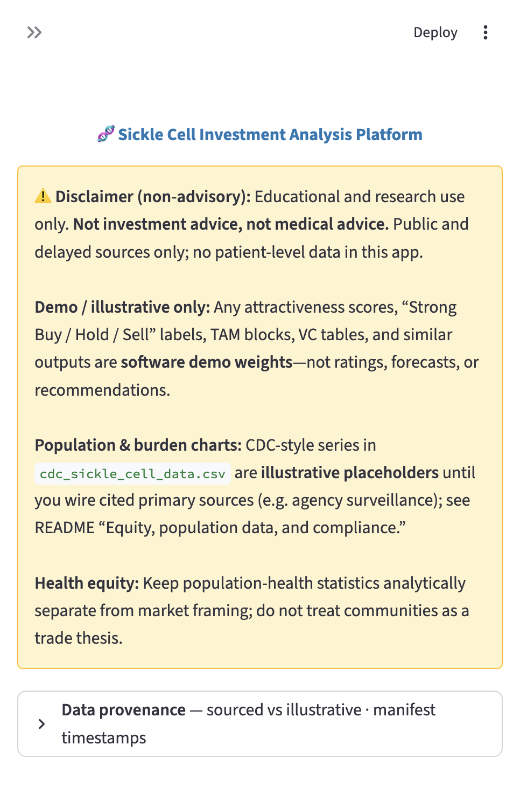
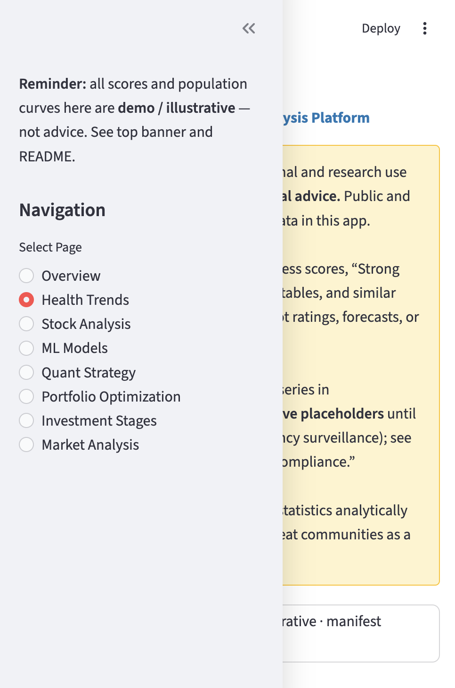
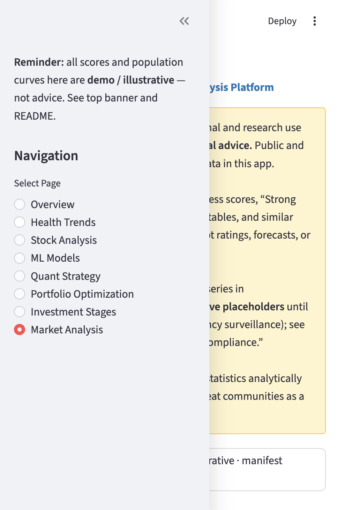

# Sickle Cell Disease Investment Analysis Platform

**Disclaimer (read first):** For **educational and research use only**. This is **not investment advice**, **not medical advice**, and not a substitute for professional counsel. Demo scores and illustrative tables are for software testing, not recommendations.

**On GitHub:** [Sickle-Cell-Investment-Analysis](https://github.com/maekass/Sickle-Cell-Investment-Analysis?tab=readme-ov-file) — README, source, and issues for this project.

## Dashboard from GitHub

GitHub stores the **Streamlit UI as code** ([`dashboard/app.py`](https://github.com/maekass/Sickle-Cell-Investment-Analysis/blob/main/dashboard/app.py)); it does **not** run the interactive app inside the README or file tree. To use the dashboard **from this GitHub repo** without cloning locally:

1. **[Open in GitHub Codespaces](https://codespaces.new/maekass/Sickle-Cell-Investment-Analysis)** — uses [`.devcontainer/devcontainer.json`](.devcontainer/devcontainer.json) to install `requirements.txt` and forward port **8501**.
2. In the Codespaces terminal (repo root), optionally refresh data then start Streamlit:
   ```bash
   python src/data_collection/collect_all_data.py
   python src/models/investment_stage_analysis.py
   python src/models/market_analysis.py
   streamlit run dashboard/app.py --server.address 0.0.0.0 --server.port 8501
   ```
3. When GitHub prompts, **open the forwarded port** for `8501` and use the **Browser** tab to load the app.

For a **public URL** without Codespaces, deploy with [Streamlit Community Cloud](#deploy-on-streamlit-community-cloud) and paste your `*.streamlit.app` link in the README there.

### Dashboard screenshots

These are **static images** checked into [`docs/screenshots/`](docs/screenshots/) so the README shows what the Streamlit UI looks like after you run the collectors (GitHub does not render the live app here). All charts and scores remain **demo / illustrative** as in the app.

**Overview** (banner, disclaimer, data provenance expander, pipeline table region):



**Health trends** (illustrative population-style series + ClinicalTrials.gov trial rows):



**Market analysis** (illustrative market-size table + demo attractiveness scores):



## One-line pitch (cover letter / resume)

End-to-end **Python research stack** combining public **sickle cell epidemiology and trial** signals with **listed biotech/pharma** data, **staged private-market framing** (VC / growth / public), and a **Streamlit** surface—explicitly **non-advisory**, public sources only, with **illustrative** market and scoring tables until you wire authoritative feeds.

## Project overview

Quantitative research tooling at the intersection of sickle cell disease epidemiology, treatment innovation, and **public-market** company data. **“Buy/Hold” style scores in sample CSVs are demo weights only**, not research or investment advice.

## Key components (ordered)

1. **(Shipped)** Public health data analysis — prevalence-style series (illustrative sample), trials (**sourced** when ClinicalTrials.gov responds), FDA rows (illustrative), adoption fields in notebooks (**Roadmap**).
2. **(Shipped)** Investment analysis — tickers and fundamentals via `yfinance` (**sourced public, delayed**); universe editable in code.
3. **(Shipped)** Investment stage analysis — VC vs growth vs public **illustrative** CSVs; `investment_stage_analysis.py`.
4. **(Roadmap)** ML and regression — notebooks and fitted pipelines not wired to the dashboard yet.
5. **(Roadmap)** Quant framework — placeholder package `src/quant_framework/` for factors, backtests, Monte Carlo.
6. **(Shipped)** Market analysis — `market_analysis.py` writes TAM-style tables, pharma rows, deal flow, **demo** attractiveness scores (**illustrative**).

## Data manifest (provenance)

After `python src/data_collection/collect_all_data.py` and `python src/models/market_analysis.py`, the repo writes **`data/raw/data_manifest.json`**: for each registered CSV it records **illustrative vs sourced (public / delayed vendor)** and **`last_modified_utc`**. The Streamlit dashboard shows this under **Data provenance** on **every** page. The manifest file is **gitignored** (regenerate locally after pulls).

## Legal disclaimer

**Educational and research use only. Not investment advice, not medical advice, not a substitute for professional counsel.** No patient-level data in this repository. Verify compliance with applicable rules (including securities and health-data use) before any production or commercial use.

**Scores and labels:** Any “attractiveness,” “Strong Buy / Hold / Sell,” or similar fields produced by `market_analysis.py` or shown in the dashboard are **demo / illustrative weights for software testing only**—not research outputs, ratings, or recommendations.

## Equity, population data, and compliance (research framing)

- **Population and burden metrics** in `cdc_sickle_cell_data.csv` are currently **illustrated time series** generated in code to stand in until you wire **primary sources** (for example [CDC sickle cell disease data](https://www.cdc.gov/ncbddd/sicklecell/data.html), peer-reviewed epidemiology, or agency surveillance). Treat them as **non-authoritative** unless you replace them with cited pulls and document the extract date in your own workflow.
- **Health equity:** Disparate burden and access are legitimate research topics; keep **population-level public statistics** separate from **market or “investment” framing**, and avoid implying that communities exist to validate a financial thesis.
- **Dashboard:** locally or in **GitHub Codespaces**, run `streamlit run dashboard/app.py` and open port **8501** — see [Dashboard from GitHub](#dashboard-from-github), [Getting started](#getting-started), and [`dashboard/app.py`](dashboard/app.py).

## Tech stack

Python 3.9+, pandas, numpy, scikit-learn, optional TensorFlow/PyTorch later, yfinance, Streamlit, Plotly, requests.

## Project structure

```
sickle_cell_investment_analysis/
├── .devcontainer/
│   └── devcontainer.json         # GitHub Codespaces: Python 3.11, deps, Streamlit port 8501
├── .github/workflows/
│   └── ci.yml                    # install deps + compileall smoke (dashboard + pipeline)
├── .streamlit/
│   └── config.toml               # local / Community Cloud defaults (e.g. usage stats)
├── data/raw/
├── docs/
│   └── screenshots/              # README gallery (static captures of the Streamlit UI)
├── notebooks/
├── src/
│   ├── data_collection/
│   │   ├── collect_all_data.py
│   │   ├── collect_health_data.py
│   │   ├── collect_stock_data.py
│   │   ├── collect_vc_growth_data.py
│   │   └── data_manifest.py    # writes data_manifest.json (provenance)
│   ├── models/
│   ├── quant_framework/
│   └── visualization/
├── dashboard/
│   └── app.py
├── requirements.txt
└── README.md
```

**Legacy / roadmap modules:** The tree may still include earlier multi-disease prototypes (for example `disease_config.py`, `health_market_analysis.py`, `trial_success_predictor.py`). They are **not** wired into `dashboard/app.py` or the `collect_*` + stage/market pipeline documented above.

## Getting started

From this directory (project root):

```bash
python -m venv .venv
source .venv/bin/activate   # Windows: .venv\Scripts\activate
pip install -r requirements.txt
python src/data_collection/collect_all_data.py
python src/models/investment_stage_analysis.py
python src/models/market_analysis.py
streamlit run dashboard/app.py
```

**Open the dashboard:** after the command starts, use **[http://localhost:8501](http://localhost:8501)** (Streamlit’s default port). If you changed the port, use the URL Streamlit prints in the terminal.

- **This project on GitHub:** [README & repository](https://github.com/maekass/Sickle-Cell-Investment-Analysis?tab=readme-ov-file)
- **Dashboard UI code on GitHub:** [`dashboard/app.py` on `main`](https://github.com/maekass/Sickle-Cell-Investment-Analysis/blob/main/dashboard/app.py)

## Deploy on Streamlit Community Cloud

GitHub hosts **source**; the UI only runs publicly if you deploy it.

1. Push this repo to GitHub (you are on [`maekass/Sickle-Cell-Investment-Analysis`](https://github.com/maekass/Sickle-Cell-Investment-Analysis)).
2. Sign in at **[Streamlit Community Cloud](https://share.streamlit.io/)** with GitHub and **Create app**.
3. Pick this repository and branch **`main`**.
4. Set **Main file path** to **`dashboard/app.py`** (repository root stays the app root so `ROOT` / `data/raw` paths resolve correctly).
5. Python version: **3.9+** (3.11 matches CI). Dependencies install from **`requirements.txt`** at the repo root.

**Data on Cloud:** Generated **`*.csv`** and **`data/raw/data_manifest.json`** are **gitignored**, so a fresh Cloud deploy starts **without** local CSVs. The app still loads and shows provenance guidance; to populate charts in the cloud you would need a supported approach (for example run collectors in a separate job and sync artifacts, use [Secrets](https://docs.streamlit.io/deploy/streamlit-community-cloud/deploy-your-app/secrets-management) for API keys if you add paid feeds, or adjust your own policy on committing non-sensitive extracts). **After your first successful deploy**, add your public app URL here for visitors:

- **Live app (Community Cloud):** _https://YOUR-APP.streamlit.app — replace after deploy_

## Data sources and network

ClinicalTrials.gov and Yahoo Finance require network access. **`collect_health_data.py`** tries the legacy ClinicalTrials.gov JSON endpoint first, then **falls back to the [v2 Studies API](https://clinicaltrials.gov/data-api/api)** if the legacy URL errors or returns nothing. Some tickers in the sample universe (e.g. delisted names) may return no price history from Yahoo Finance; refresh the ticker map as needed.

## What changed vs the original single-file spec

- Added **`collect_all_data.py`** orchestrator referenced in your quick-start.
- **Renumbered** component list for readability.
- Fixed **VC implied multiple** in `investment_stage_analysis.py` (uses `vc_deals`, not growth deals).
- **`data_manifest.json`** (generated, gitignored) plus **per-page provenance** in the dashboard.
- **`.gitignore`** ignores generated `*.csv` and `data/raw/data_manifest.json` while keeping `data/raw/.gitkeep`.
- **GitHub ↔ local:** Merged unrelated histories once; canonical README and pipeline match the sickle cell Streamlit stack above; **Community Cloud** deploy steps and **`.streamlit/config.toml`** added; placeholder **Django** workflow removed in favor of **`ci.yml`** compile smoke.
- **Dashboard on GitHub:** **`.devcontainer/devcontainer.json`** plus README [Dashboard from GitHub](#dashboard-from-github) so you can run Streamlit in **Codespaces** from the green **Code** button; **screenshots** under `docs/screenshots/` preview the UI in this README.
