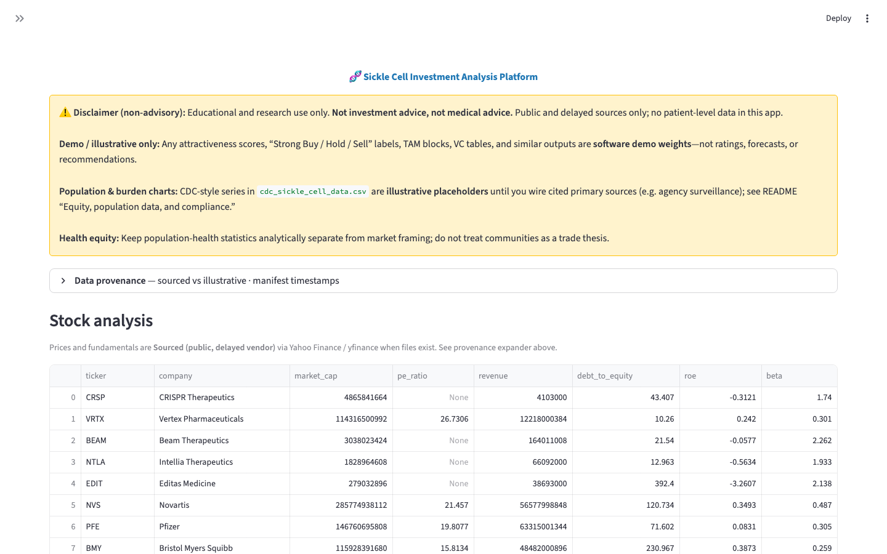
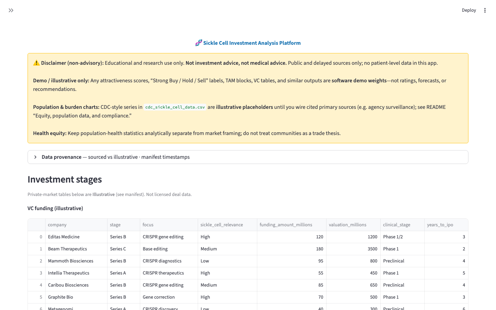

# Immunology Investment Analysis Dashbord and Platform

> **Disclaimer:** For **educational and research use only**. This is **not investment advice**, **not medical advice**, and not a substitute for professional counsel. Demo scores and illustrative tables are for software testing only—not recommendations.

**Repository:** [maekass/sickle-cell-investment-analysis](https://github.com/maekass/sickle-cell-investment-analysis) · UI entrypoint: [`dashboard/app.py`](dashboard/app.py)

## Run the Streamlit dashboard

GitHub shows **source and screenshots** only. The interactive app runs when you start Streamlit **locally**, in **GitHub Codespaces**, or on **[Streamlit Community Cloud](https://share.streamlit.io/)**.

[](https://share.streamlit.io/deploy?repository=https://github.com/maekass/sickle-cell-investment-analysis&branch=main&mainPath=dashboard%2Fapp.py)

| Where | What to do |
|--------|------------|
| **Codespaces** (recommended) | [Create a codespace](https://codespaces.new/maekass/sickle-cell-investment-analysis) on `main`, then follow [Quick start (Codespaces)](#quick-start-codespaces) below. Open the app from **Ports → 8501 → Open in Browser** (`https://<your-codespace-name>-8501.app.github.dev`). |
| **Local machine** | From repo root: `streamlit run dashboard/app.py` → [http://localhost:8501](http://localhost:8501) |
| **Community Cloud** | **[Live app](https://immunology-investment-dashboard.streamlit.app)** — first load auto-builds demo CSVs (~1–2 min). Main file: `dashboard/app.py`, branch `main`, Python **3.11**. |

### Quick start (Codespaces)

1. [Open in GitHub Codespaces](https://codespaces.new/maekass/sickle-cell-investment-analysis) (or [full create URL](https://github.com/codespaces/new?hide_repo_select=true&ref=main&repo=maekass%2Fsickle-cell-investment-analysis)).
2. Wait for [`.devcontainer/devcontainer.json`](.devcontainer/devcontainer.json) to install `requirements.txt` and forward port **8501**.
3. In the terminal at the **repository root** (optional data refresh, then Streamlit):

```bash
python3 src/data_collection/collect_all_data.py
python3 src/models/investment_stage_analysis.py
python3 src/models/market_analysis.py
streamlit run dashboard/app.py --server.address 0.0.0.0 --server.port 8501
```

Skip the three `python3` lines if you only need the UI shell (charts stay empty until collectors run).

4. **Ports** → **8501** → **Open in Browser**. Use `--server.address 0.0.0.0` so forwarding works.

**Editor shortcut:** **Terminal → Run Task… → “Streamlit: dashboard (port 8501)”** ([`.vscode/tasks.json`](.vscode/tasks.json)).

### Codespaces troubleshooting

| Issue | What to do |
|--------|------------|
| `pf-signin` or “no access” on the forwarded URL | Sign in with the GitHub account that owns the codespace; in **Ports**, try **Port visibility → Public**. |
| “Site can’t be reached” | Confirm **8501** is **Forwarded** and Streamlit is still running in the terminal. |
| Blank page after open | Use `--server.address 0.0.0.0`, not `localhost` only. |
| `streamlit: command not found` | Run `python3 -m streamlit run dashboard/app.py --server.address 0.0.0.0 --server.port 8501`. |
| Dependency errors | `python3 -m pip install -r requirements.txt` from the repo root. |

### Dashboard screenshots

**1440×900** captures taken with sidebar collapsed, including graphs and tables. Regenerate any time with `python3 scripts/capture_screenshots.py` (Streamlit running on port 18501 + `playwright` installed).

**Overview** — disclaimer banner · gene therapy pipeline table · POS bar chart (illustrative):


**Health Trends** — prevalence line chart (illustrative) · trials-by-start-year bar chart (ClinicalTrials sample) · trial table:


**Stock Analysis** — company financials table (live via yfinance, public/delayed):



**Investment Stages** — VC / growth equity deal tables (illustrative):



**Market Analysis** — TAM table · demo investment attractiveness scores:


## One-line pitch (cover letter / resume)

End-to-end **Python research stack** combining public **sickle cell epidemiology and trial** signals with **listed biotech/pharma** data, **staged private-market framing** (VC / growth / public), and a **Streamlit** surface—explicitly **non-advisory**, public sources only, with **illustrative** market and scoring tables until you wire authoritative feeds.

## Project overview

Quantitative research tooling at the intersection of sickle cell disease epidemiology, treatment innovation, and **public-market** company data. **“Buy/Hold” style scores in sample CSVs are demo weights only**, not research or investment advice.

## Key components (ordered)

1. **(Shipped)** Public health data analysis — prevalence-style series (illustrative sample), trials (**sourced** when ClinicalTrials.gov responds), FDA rows (illustrative), adoption fields in notebooks (**Roadmap**).
2. **(Shipped)** Investment analysis — tickers and fundamentals via `yfinance` (**sourced public, delayed**); universe editable in code.
3. **(Shipped)** Investment stage analysis — VC vs growth vs public **illustrative** CSVs; `investment_stage_analysis.py`.
4. **(Shipped)** ML models — fitted Ridge/Random Forest + trial-success classifiers; training CSVs in `data/processed/`, models in `data/models/`; **ML Models** dashboard page (`python3 scripts/train_models.py` to refresh).
5. **(Shipped)** Quant strategy & portfolio optimization — backtests, factor betas, Monte Carlo fan, efficient frontier (`scripts/train_quant.py`, `data/processed/quant/`).
6. **(Shipped)** Market analysis — `market_analysis.py` writes TAM-style tables, pharma rows, deal flow, **demo** attractiveness scores (**illustrative**).

## Data manifest (provenance)

After `python src/data_collection/collect_all_data.py` and `python src/models/market_analysis.py`, the repo writes **`data/raw/data_manifest.json`**: for each registered CSV it records **illustrative vs sourced (public / delayed vendor)** and **`last_modified_utc`**. The Streamlit dashboard shows this under **Data provenance** on **every** page. The manifest file is **gitignored** (regenerate locally after pulls).

## Legal disclaimer

**Educational and research use only. Not investment advice, not medical advice, not a substitute for professional counsel.** No patient-level data in this repository. Verify compliance with applicable rules (including securities and health-data use) before any production or commercial use.

**Scores and labels:** Any “attractiveness,” “Strong Buy / Hold / Sell,” or similar fields produced by `market_analysis.py` or shown in the dashboard are **demo / illustrative weights for software testing only**—not research outputs, ratings, or recommendations.

## Equity, population data, and compliance (research framing)

- **Population and burden metrics** in `cdc_sickle_cell_data.csv` and `epidemiology_*.csv` are built from **[Orphadata](https://api.orphadata.com/)** U.S. point-prevalence rates (CC BY 4.0), **CDC-cited** sickle cell birth anchors, and ClinicalTrials.gov **sample** counts—not live agency surveillance extracts. Re-run `python3 src/data_collection/collect_all_data.py` with network access to refresh provenance.
- **Health equity:** Disparate burden and access are legitimate research topics; keep **population-level public statistics** separate from **market or “investment” framing**, and avoid implying that communities exist to validate a financial thesis.
- **Dashboard:** locally or in **GitHub Codespaces**, run `streamlit run dashboard/app.py` and open port **8501** — see [Run the Streamlit dashboard](#run-the-streamlit-dashboard), [Getting started](#getting-started), and [`dashboard/app.py`](dashboard/app.py).

## Tech stack

Python 3.9+, pandas, numpy, scikit-learn, optional TensorFlow/PyTorch later, yfinance, Streamlit, Plotly, requests.

## Project structure

```
sickle_cell_investment_analysis/
├── .devcontainer/
│   └── devcontainer.json         # GitHub Codespaces: Python 3.11, deps, Streamlit port 8501
├── .github/workflows/
│   └── ci.yml                    # install deps + compileall smoke (dashboard + pipeline)
├── .streamlit/
│   └── config.toml               # local / Community Cloud defaults (e.g. usage stats)
├── .vscode/
│   └── tasks.json                # "Streamlit: dashboard" task (Codespaces / VS Code)
├── data/raw/
├── docs/
│   └── screenshots/              # README gallery (static captures of the Streamlit UI)
├── notebooks/
├── src/
│   ├── data_collection/
│   │   ├── collect_all_data.py
│   │   ├── collect_health_data.py
│   │   ├── collect_stock_data.py
│   │   ├── collect_vc_growth_data.py
│   │   └── data_manifest.py    # writes data_manifest.json (provenance)
│   ├── models/
│   ├── quant_framework/
│   └── visualization/
├── dashboard/
│   └── app.py
├── requirements.txt
└── README.md
```

**Legacy / roadmap modules:** The tree may still include earlier multi-disease prototypes (for example `disease_config.py`, `health_market_analysis.py`, `trial_success_predictor.py`). They are **not** wired into `dashboard/app.py` or the `collect_*` + stage/market pipeline documented above.

## Getting started

From this directory (project root):

```bash
python -m venv .venv
source .venv/bin/activate   # Windows: .venv\Scripts\activate
pip install -r requirements.txt
python src/data_collection/collect_all_data.py
python src/models/investment_stage_analysis.py
python src/models/market_analysis.py
streamlit run dashboard/app.py
```

**Open the dashboard:** after the command starts, use **[http://localhost:8501](http://localhost:8501)** (Streamlit’s default port). If you changed the port, use the URL Streamlit prints in the terminal.

- **This project on GitHub:** [README & repository](https://github.com/maekass/sickle-cell-investment-analysis?tab=readme-ov-file)
- **Dashboard UI code on GitHub:** [`dashboard/app.py` on `main`](https://github.com/maekass/sickle-cell-investment-analysis/blob/main/dashboard/app.py)

## Deploy on Streamlit Community Cloud ([share.streamlit.io](https://share.streamlit.io/))

This repo is **organized for [Community Cloud](https://docs.streamlit.io/deploy/streamlit-community-cloud/deploy-your-app/file-organization)**: working directory is the **repository root**, config lives in **`.streamlit/config.toml`**, and dependencies are declared in **`requirements.txt`**. The app entry file is **`dashboard/app.py`** (paths like `data/raw/` resolve from the repo root, matching local `streamlit run dashboard/app.py`).

### One-time setup

1. **GitHub:** Ensure [`maekass/sickle-cell-investment-analysis`](https://github.com/maekass/sickle-cell-investment-analysis) is pushed and that you have **admin or write** access.
2. **Streamlit account:** Open **[https://share.streamlit.io/](https://share.streamlit.io/)** and sign in (GitHub is the usual identity).
3. **Connect GitHub to Streamlit:** Grant the Streamlit GitHub App access to this repository when prompted ([connect GitHub](https://docs.streamlit.io/deploy/streamlit-community-cloud/get-started/connect-your-github-account)).
4. **Create app:** In your workspace, click **Create app** (upper right) → **Deploy a public app from GitHub** (or your workspace’s equivalent).
5. **Repository:** `maekass/sickle-cell-investment-analysis` — **Branch:** `main`.
6. **Main file path:** `dashboard/app.py` (use forward slashes; do **not** set a custom root that breaks `ROOT` in code).
7. **Python:** In **Advanced settings**, choose **3.11** (matches CI and `.devcontainer`).
8. **Deploy** and wait for the build. If it fails, open **Manage app → Logs** and fix missing dependencies in `requirements.txt`.

### Official references

- [Prep and deploy on Community Cloud](https://docs.streamlit.io/deploy/streamlit-community-cloud/deploy-your-app)  
- [File organization (entrypoint + `requirements.txt` + `.streamlit/`)](https://docs.streamlit.io/deploy/streamlit-community-cloud/deploy-your-app/file-organization)  
- [App dependencies (`requirements.txt`, optional `packages.txt`)](https://docs.streamlit.io/deploy/streamlit-community-cloud/deploy-your-app/app-dependencies)  
- [Secrets management](https://docs.streamlit.io/deploy/streamlit-community-cloud/deploy-your-app/secrets-management) (only if you add API keys)

### After deploy: README badge (optional)

```markdown
[](https://immunology-investment-dashboard.streamlit.app)
```

### Data on Cloud (important)

Generated **`*.csv`** and **`data/raw/data_manifest.json`** are **gitignored**. On **first visit**, the dashboard runs **`bootstrap_data`** (collectors + stage/market scripts) so tables and charts populate automatically—allow **1–2 minutes** and refresh if needed. To **pre-build data elsewhere** you can, for example:

- Run **`collect_all_data.py`** (and stage/market scripts) in **[GitHub Codespaces](https://codespaces.new/maekass/sickle-cell-investment-analysis)**, then **commit** selected outputs if your compliance policy allows; or  
- Add a **scheduled job** elsewhere that writes into a bucket you read from the app; or  
- Use **[Secrets](https://docs.streamlit.io/deploy/streamlit-community-cloud/deploy-your-app/secrets-management)** for API keys and extend collectors (not included by default).

See **[Run the Streamlit dashboard](#run-the-streamlit-dashboard)** at the top of this README for Codespaces, local, and Community Cloud entry points.

## Data sources and network

ClinicalTrials.gov and Yahoo Finance require network access. **`collect_health_data.py`** tries the legacy ClinicalTrials.gov JSON endpoint first, then **falls back to the [v2 Studies API](https://clinicaltrials.gov/data-api/api)** if the legacy URL errors or returns nothing. Some tickers in the sample universe (e.g. delisted names) may return no price history from Yahoo Finance; refresh the ticker map as needed.

## What changed vs the original single-file spec

- Added **`collect_all_data.py`** orchestrator referenced in your quick-start.
- **Renumbered** component list for readability.
- Fixed **VC implied multiple** in `investment_stage_analysis.py` (uses `vc_deals`, not growth deals).
- **`data_manifest.json`** (generated, gitignored) plus **per-page provenance** in the dashboard.
- **`.gitignore`** ignores generated `*.csv` and `data/raw/data_manifest.json` while keeping `data/raw/.gitkeep`.
- **GitHub ↔ local:** Merged unrelated histories once; canonical README and pipeline match the sickle cell Streamlit stack above; **Community Cloud** deploy steps and **`.streamlit/config.toml`** added; placeholder **Django** workflow removed in favor of **`ci.yml`** compile smoke.
- **Streamlit Community Cloud:** README [Deploy on Streamlit Community Cloud](#deploy-on-streamlit-community-cloud-sharestreamlitio) expanded for [share.streamlit.io](https://share.streamlit.io/) (steps, docs links, badge snippet, data strategy); `.streamlit/config.toml` sets `[server] headless = true`; `requirements.txt` pins `streamlit>=1.28.0`; dashboard **empty-data** warning mentions Cloud + Codespaces.
