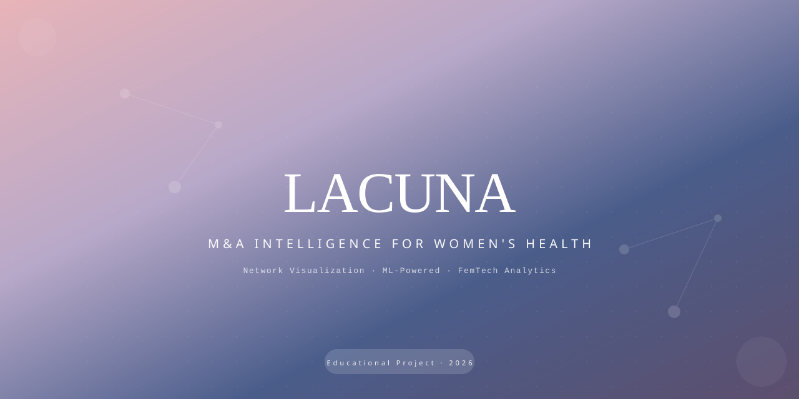

<!--
SEO Meta Description: Lacuna — an evidence layer for understanding how capital is structured around scientifically complex healthcare assets. Women's health is the initial research laboratory, spanning clinical evidence, population health, creative financing, governance, M&A, and IPO/strategic outcomes.
-->

<h1 align="center">Lacuna</h1>

<p align="center">
  <strong>An evidence layer for science, capital structure, governance, and strategic outcomes in healthcare</strong>
</p>

<blockquote align="center">
  <p><strong>Women's health is the initial laboratory · public-source evidence · creative financing · capital structure · governance · M&amp;A / IPO pathways · Not investment advice.</strong></p>
</blockquote>

<p align="center">
  <a href="https://lacuna-maekass.vercel.app">
    
  </a>
</p>

<p align="center">
  <a href="https://nextjs.org"></a>
  <a href="https://react.dev"></a>
  <a href="https://typescriptlang.org"></a>
  <a href="https://nodejs.org"></a>
  <a href="https://d3js.org"></a>
  <a href="docs/MODEL_CARD.md"></a>
  <a href="LICENSE"></a>
  <a href="https://lacuna-maekass.vercel.app"></a>
</p>

## What Lacuna is

Lacuna is a **public-source evidence layer for understanding how capital is structured around scientifically complex healthcare assets**.

The project began with women’s-health M&A and commercialization, but the deeper research problem is broader: connecting **scientific evidence, clinical risk, population need, capital structure, creative financing, governance/control, strategic optionality, and eventual outcomes**.

Rather than competing with healthcare data terminals or private-markets databases on breadth, Lacuna focuses on the connective tissue those systems often leave fragmented:

**Science → clinical evidence → population need → capital → financing structure → governance/control → strategy → outcome**

Women's health is the initial laboratory because it is a sufficiently focused domain in which these relationships can be reconstructed carefully from public evidence. The architecture is intended to generalize to precision medicine, oncology, orphan drugs, diagnostics, devices, and other scientifically complex healthcare markets.

The central research question is not simply *who funded or acquired whom?* It is:

> **Given what was knowable about an underlying healthcare asset at a particular point in time, why might a particular form of capital, financing structure, governance arrangement, or strategic transaction have made sense?**

Lacuna therefore treats creative financing as a first-class research dimension: equity, venture and growth financing, strategic investment, structured financing, royalty or revenue interests, licensing, milestone structures, asset transactions, recapitalizations, IPOs, and acquisitions can all be analyzed as different responses to changing scientific, clinical, commercial, and capital constraints.

The goal is not to reproduce proprietary financial datasets. It is to build a **provider-agnostic evidence layer** that can enrich authorized financial data—whether supplied through a customer's existing data license, CSV/Excel export, public-market source, or public filings—with clinical, scientific, regulatory, reimbursement, population, and provenance context.

The product's potential value therefore comes less from raw record count than from **entity resolution, transaction reconstruction, longitudinal evidence, provenance, and the ability to connect otherwise separate datasets into a decision-useful research graph**.

The product app runs on **Vercel** from this repository. A separate **Framer**
site is brand and narrative only, with one call to action into the app —
[SITE_ARCHITECTURE.md](docs/SITE_ARCHITECTURE.md).

**Live demo:** [lacuna-maekass.vercel.app](https://lacuna-maekass.vercel.app)

## Integrity boundaries

| Boundary                              | What that means here                                                                                                                                                                                                                                                              |
| ------------------------------------- | --------------------------------------------------------------------------------------------------------------------------------------------------------------------------------------------------------------------------------------------------------------------------------- |
| Not a live institutional terminal     | Default data is the committed file `src/data/dataset.verified.json` (dataset v9). It is a convenience sample with public citations, not PitchBook, a data SLA, or a census of women’s-health M&A.                                                                                 |
| Not advice                            | The app does not provide investment advice, clinical guidance, treatment recommendations, or patient-specific interpretation.                                                                                                                                                     |
| Scores stay descriptive               | Exit Similarity Explorer and the comparables panel are hand-weighted indexes on this catalog. They are not predictions, probabilities, forecasts, calibrated models, enterprise valuations, or expected returns. Read [MODEL_CARD.md](docs/MODEL_CARD.md) before citing a number. |
| No causal claims                      | `/methods` reports record quality, sector counts, and announcement timing. It does not identify causal effects, treatment effects, or Bayesian causal estimates.                                                                                                                  |
| Trial models withheld                 | Offline clinical-trial classifiers exist in the repo. Percentages stay off the public UI while `trainingSource` is `synthetic_seed`. Live trial **search** (ClinicalTrials.gov) is separate and is not a model score. See [ML_CLINICAL_TRIALS.md](docs/ML_CLINICAL_TRIALS.md).    |
| No synthetic rows in the deal product | Public deal counts, networks, and disclosed-value totals come from the verified JSON. Staging, seed files, and illustrative heuristics are not merged into those figures. See [DATA_BOUNDARIES.md](docs/DATA_BOUNDARIES.md).                                                      |

When a field is missing, panels show insufficient disclosed data. They do not
fill gaps with TAM/SAM, sector-multiple fallbacks, or editorial stage medians.

## What you can do in the app

| Workspace       | Route           | Role                                                                                                                                                              |
| --------------- | --------------- | ----------------------------------------------------------------------------------------------------------------------------------------------------------------- |
| Deals           | `/deals`        | Source-linked network, announced-year activity, disclosed-value matrix, acquirer patterns, comparable context, similarity bands                                   |
| Consumer health | `/consumer`     | Same catalog, filtered to wearables, wellness apps, and consumer digital health                                                                                   |
| Deal dossier    | `/deals/[id]`   | One verified transaction and its citations. Name-search trials, FDA, and CMS results are not attached unless a reviewer has keyed a public NCT or CPT citation    |
| Payer Ops       | `/payer-ops`    | Prior-authorization and claims-ops context plus venture signals computed from the verified catalog                                                                |
| Research        | `/research`     | Trial search, evidence-maturity and burden context, health-equity markers, optional genetics browser. Heuristics here are labeled and do not feed deal economics  |
| Intelligence    | `/intelligence` | Reimbursement questions, precedent maps, and dataset export. Fit scores are affinity, not premiums or comps                                                       |
| Methods         | `/methods`      | Record-quality grades, observed sector composition, and announcement timing on the verified set. This page does not publish causal effects or Bayesian posteriors |

| Pinned catalog fact                    | Role in the public app                  |
| -------------------------------------- | --------------------------------------- |
| **51 medicine & biotech acquisitions** | Default Deals scope                     |
| **8 consumer health acquisitions**     | `/consumer` filter of the same file     |
| **46 fund portfolio investments**      | Overlays, not extra closed acquisitions |
| 50 of 59 deals                         | Rows that disclose a price              |

## Capital, creative financing, and transaction evidence

Lacuna treats transactions as more than rows in a deal database. A financing event can change dilution, governance, control, runway, strategic rights, and the set of future options available to an asset or company.

The research model is designed to capture:

- **Asset:** disease, mechanism, biomarker, technology, clinical stage, regulatory status.
- **Evidence:** publications, trials, endpoints, investigators, institutions, clinical milestones, and evidence strength.
- **Population:** burden, unmet need, affected populations, disparities, and market-access context.
- **Capital:** equity, debt, strategic investment, venture/growth rounds, royalty or revenue financing, licensing, milestones, and other structured instruments.
- **Governance:** ownership, board or voting rights, conversion mechanics, liquidation preferences, strategic rights, and changes in control where disclosed.
- **Strategy:** partnerships, licensing, asset sales, acquisitions, IPOs, recapitalizations, and other strategic pathways.
- **Outcome:** subsequent financing, commercialization, acquisition, public-market transition, licensing, restructuring, or failure/continuation.

The current public catalog remains a curated sample rather than a census. Its purpose is to establish the evidence and provenance infrastructure needed to reconstruct these relationships responsibly.

- n=59 verified deals · 150 companies · 38 acquirers.
- `dataset.verified.json` v9 (`provenance.lastUpdated: 2026-09-20`).
- Sources are public: SEC filings, press releases, investor relations, and fund
  portfolio listings, graded in
  [DATA_CURATION_CHECKLIST.md](docs/DATA_CURATION_CHECKLIST.md). Promotion does
  not invent sector, headquarters, or founded year.
- Disclosed-value headlines are **sums of observed prices** on completed
  women’s-health deals that published a number. They are not total market
  volume. Current pinned figures and the sampling frame are in
  [LIMITATIONS.md](docs/LIMITATIONS.md). Coverage against an external exit list
  is an observed ratio, not a capture-recapture estimate.
- Acquirer panels report counts, sector mix, timing, and disclosed size. They do
  not infer strategy, synergies, or the next target. See
  [COMPETITIVE_ANALYSIS_METHODOLOGY.md](docs/COMPETITIVE_ANALYSIS_METHODOLOGY.md).

## Creative Financing Atlas

A longer-term research direction is a **Creative Financing Atlas**: a carefully reconstructed set of healthcare transactions in which the financing instrument itself is analytically important.

The initial unit of analysis is not simply a company or funding round. It is the relationship between an underlying asset's changing risk profile and the capital structure used to finance it.

Questions the evidence layer is designed to support include:

- How did financing structures change as clinical risk declined?
- When did strategic investment, licensing, royalty/revenue financing, or structured capital appear relative to clinical milestones?
- Did governance or control change as an asset moved from scientific risk toward commercial risk?
- What capital structures appeared around companies approaching an IPO or strategic transaction?
- Which information was observable **before** a major transaction, rather than only after the outcome?
- How did scientific validation, regulatory events, reimbursement evidence, and population need interact with financing choices?

These are research questions, not predictive claims. Lacuna does not infer undisclosed motives, assign investment recommendations, or treat a financing structure as proof of an outcome.

## Research and reimbursement context

**Clinical trials.** `/api/clinical-trials` searches ClinicalTrials.gov. That
volume is not deal coverage. Model-derived women’s-health relevance and
completion-proxy badges are withheld until training uses live registry labels
rather than the synthetic seed artifact.

**Reimbursement.** Source-traceable fee-schedule and coverage questions live
under `src/lib/reimbursement/` and ship only after review. Older multiple tables
(for example insurance-driven versus consumer-only “premiums”) are unsupported
rules of thumb and are not analytical output. See
[REIMBURSEMENT_INTELLIGENCE.md](docs/REIMBURSEMENT_INTELLIGENCE.md).

**Health equity.** Marker panels cite published disparity statistics (CDC, ACS,
and similar). They are context. They are not market sizing or allocation advice.

**Narratives.** Optional copy from `POST /api/ai/insights` uses Vercel AI
Gateway when a key is configured and returns 503 otherwise. Narrative text does
not override dataset fields or heuristic labels. See
[INFERENCE.md](docs/INFERENCE.md).

## US Evidence Graph

The **US Evidence Graph** is a separate research layer for source-linked
regulatory, surveillance, claims, trial, epidemiology, funding, pricing, and
workforce observations. It does not merge research observations into
`dataset.verified.json`.

Each promoted observation preserves its subject and metric, value plus any
comparator, primary source and locator, geography and population when known,
point-in-time `asOf` semantics, evidence type, and limitations. Historical
snapshots use source publication dates to prevent future-information leakage.

The first vertical slice covers **ferric carboxymaltose (Injectafer)**. It
preserves the August 2026 FDA supplement adding a boxed warning for symptomatic
hypophosphatemia and FDA's September 2026 Sentinel statement that
serum-phosphate testing occurred in **fewer than 20%** of administration
episodes. The latter is stored as an upper bound (`value: 0.2`,
`comparator: "lt"`), not as an exact 20% rate.

The ingestion foundation also includes a typed openFDA device client for 510(k),
PMA, adverse-event, recall, UDI, and classification endpoints, plus a federal
source catalog for FDA postmarketing requirements/commitments, CDRH
real-world-evidence precedents, women-specific devices, and openFDA.

**Translation boundary:** US evidence can generate a deployment question or
constraint for a target-market case, but it must not silently become a non-US
parameter. US utilization is not non-US uptake; US reimbursement is not non-US
price; and US surveillance results require separate applicability evidence
before translation.

See [EVIDENCE_GRAPH.md](docs/EVIDENCE_GRAPH.md) for the evidence contract and
[MARKET_ACCESS.md](docs/MARKET_ACCESS.md) for the separate deterministic demand
and budget-impact workbench.

## Therapeutics ontology

A separate therapeutics graph sits beside the verified acquisition dataset. It
does not replace those deals. The first reference vertical is **endometriosis**.
It is a curated, source-linked demonstration of disease, asset, trial,
regulatory, and catalyst records. It is not yet a comprehensive therapeutics
database, and it does not produce an investment score or an rNPV.

Normalized ClinicalTrials.gov studies and FDA regulatory events keep their
source identifiers. Historical snapshots use publication dates, so a later
document does not become evidence for an earlier date. Analyst assumptions stay
on an investment-thesis object and are not written into the evidence layer.

Developer inspection: `/therapeutics/endometriosis` (noindex). See
[THERAPEUTICS_ONTOLOGY.md](docs/THERAPEUTICS_ONTOLOGY.md).

## Stack

| Layer                                             | In the public app                                                                                                     |
| ------------------------------------------------- | --------------------------------------------------------------------------------------------------------------------- |
| Next.js 16, React 19, TypeScript, Tailwind CSS v4 | App shell. Node **24** (`.nvmrc`)                                                                                     |
| D3.js v7, Framer Motion                           | Network and charts                                                                                                    |
| `getVerifiedDataset()`                            | Default path; static JSON on Vercel                                                                                   |
| US Evidence Graph (`src/lib/evidenceGraph`)       | Point-in-time source-backed research observations; separate from verified M&A JSON                                    |
| Therapeutics ontology (`src/lib/therapeutics`)    | Asset-level disease graph. Endometriosis is the first reference vertical, not a full therapeutics database            |
| Market access (`src/lib/marketAccess`)            | Deterministic demand funnels and budget-impact scenarios                                                              |
| simple-statistics                                 | Descriptive summaries, cosine similarity, k-means labels                                                              |
| PostgreSQL                                        | Optional `LACUNA_DATA_MODE=db` — not required to run the demo                                                         |
| ClickHouse variant catalog                        | Optional and off by default. Not clinical-grade genomics. [GENOMICS_VARIANT_STORE.md](docs/GENOMICS_VARIANT_STORE.md) |

**Checks:** `npm run lint` · `npm run typecheck` · `npm test` ·
`npm run deno:fmt:check` · `npm run deno:lint` · `npm run validate:dataset` ·
`npm run build:ci` (`LACUNA_DATA_MODE=static`).

## Quick start

```bash
git clone https://github.com/maekass/Lacuna.git
cd Lacuna
nvm use 24
npm install
npm run dev
```

Open `http://localhost:3000`. Optional Postgres and the variant store are
documented in [INFRASTRUCTURE.md](docs/INFRASTRUCTURE.md).

## Documentation

| Doc                                                                             | Use it for                                           |
| ------------------------------------------------------------------------------- | ---------------------------------------------------- |
| [MODEL_CARD.md](docs/MODEL_CARD.md)                                             | What each on-screen score is                         |
| [EVIDENCE_GRAPH.md](docs/EVIDENCE_GRAPH.md)                                     | US evidence contract and translation boundary        |
| [THERAPEUTICS_ONTOLOGY.md](docs/THERAPEUTICS_ONTOLOGY.md)                       | Endometriosis reference graph and evidence rules     |
| [MARKET_ACCESS.md](docs/MARKET_ACCESS.md)                                       | Demand, budget impact, and publication gate          |
| [LIMITATIONS.md](docs/LIMITATIONS.md)                                           | Disclosed-value definition and live totals           |
| [DATA_BOUNDARIES.md](docs/DATA_BOUNDARIES.md)                                   | Verified vs staging vs enrichment                    |
| [COMPETITIVE_ANALYSIS_METHODOLOGY.md](docs/COMPETITIVE_ANALYSIS_METHODOLOGY.md) | Observable acquirer facts vs inferred intent         |
| [ML_CLINICAL_TRIALS.md](docs/ML_CLINICAL_TRIALS.md)                             | Why trial-model percentages are withheld             |
| [REIMBURSEMENT_INTELLIGENCE.md](docs/REIMBURSEMENT_INTELLIGENCE.md)             | What must not be published as reimbursement evidence |
| [INFERENCE.md](docs/INFERENCE.md)                                               | Optional server LLM                                  |
| [AGENTS.md](AGENTS.md)                                                          | Contributor conventions                              |

## License and author

[BSL 1.1](LICENSE). Research and education use is allowed. A commercial product
that competes as women’s-health M&A intelligence needs a separate license
([mps5cy@virginia.edu](mailto:mps5cy@virginia.edu)). The license converts to
Apache 2.0 in May 2030.

**[Mae Kass](https://github.com/maekass)** — MS/MPH; PsyD candidate; incoming
MBA (2027). Signatory to the
[G20 & G7 Health and Development Partnership H20 Call to Action](https://www.icn.ch/sites/default/files/2024-08/H20%20Call%20to%20action%20-%20Final%20version.pdf)
(August 2024).
