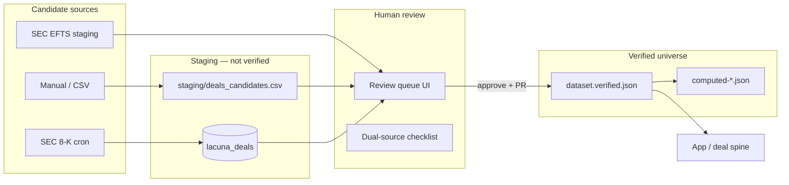

# Epic: Expand the deal universe (honest ingest → review → promote)

**Goal:** Grow `dataset.verified.json` from a curated snapshot (~59 deals)
through **attested public sources** and **human review** — without claiming
exhaustive 8-K / NIH / web coverage.

**Non-goal:** Auto-merge crawled deals, silent universe expansion, or
PitchBook-scale M&A feeds.

Pair with [NEW_DEAL_WORKFLOW.md](./NEW_DEAL_WORKFLOW.md) (promotion rules) and
[SPRINT_DEAL_SPINE.md](./SPRINT_DEAL_SPINE.md) (product surfaces for verified
deals only).

---

## What exists today

| Layer                  | Status                      | Notes                                                         |
| ---------------------- | --------------------------- | ------------------------------------------------------------- |
| **Verified universe**  | `dataset.verified.json`     | Source of truth for the app; dual-attested manual curation    |
| **SEC 8-K Item 2.01**  | Cron + CLI → `lacuna_deals` | `pending` / `pending_review`; **never** auto-merged           |
| **SEC EFTS full-text** | `npm run sec:search-ma`     | Staging JSON; manual review                                   |
| **SEC Form D**         | `lacuna_funding_events`     | Funding, not M&A; separate table                              |
| **ClinicalTrials.gov** | Live API + ML ingest        | Trials research — **not** deal records                        |
| **NIH RePORTER**       | Company enrichment API      | Grant context — **not** deal ingestion                        |
| **Free API batch**     | `download:free-apis`        | Export folder; no unified deal queue                          |
| **Review UI**          | `/deals#review`             | Staging dossier, promotion preview, unified Review Console ✅ |
| **Hub changelog**      | Hub + Methods footnotes     | Verified vs staging candidate counts ✅                       |

**Bottom line:** Review Console (Phase E) shipped on pathway branch — staging
dossier, promotion preview, auth, metrics. See
[EPIC_REVIEW_CONSOLE.md](./EPIC_REVIEW_CONSOLE.md) and
[DEMO_SCRIPTS.md](./DEMO_SCRIPTS.md).

---

## Architecture (target state)



Trials (CT.gov), NIH grants, and web enrichment **enrich** deal pages — they do
not silently add rows to `acquisitions[]`.

---

## Phased delivery

### Phase A — Review queue (MVP universe expansion) — ~8 days

Make SEC staging **visible and actionable**.

| Day | Deliverable                                                                    |
| --- | ------------------------------------------------------------------------------ |
| A1  | `listPendingDeals()` + types in `src/lib/ingestion/pendingDeals.ts`            |
| A2  | `GET /api/deals/pending` (paginated, auth optional `CRON_SECRET` or admin key) |
| A3  | `PATCH /api/deals/pending/[dealId]` — status, `review_notes`                   |
| A4  | `DealReviewQueue` component on `/deals#pipelines` (replace static copy)        |
| A5  | Row detail: filing URL, Item 2.01 excerpt, WH keywords, confidence             |
| A6  | Approve/reject actions + optimistic UI                                         |
| A7  | Link queue count in `PipelineStatusStrip` (“N pending review”)                 |
| A8  | Docs + tests; wire `DataIngestPanel` to real pending count                     |

**Phase A complete.** Operator can review SEC candidates in-app without `psql`.

---

### Phase B — Promote workflow (verified growth) — ~6 days

Close the loop from `approved` → JSON **without** auto-merge.

| Day | Deliverable                                                                            |
| --- | -------------------------------------------------------------------------------------- |
| B1  | `buildPromotionDraft(row)` → suggested `companies` / `acquirers` / `acquisitions` JSON |
| B2  | CLI `npm run deals:promote-draft -- --deal-id=…` prints merge-ready blocks             |
| B3  | Promotion checklist UI (dual-source gates from `NEW_DEAL_WORKFLOW.md`)                 |
| B4  | `markPromoted(dealId)` in Postgres after manual JSON merge (status `merged`)           |
| B5  | Migration `008_lacuna_deals_merged_status.sql` if needed                               |
| B6  | Runbook section: promote → `validate:dataset` → `compute:all` → PR                     |

**Done when:** One SEC candidate can flow: cron → review → approve → JSON edit →
CI green → deploy.

---

### Phase C — Hub changelog & trust — ~4 days

Show growth **honestly** on the product surface.

| Day | Deliverable                                                                       |
| --- | --------------------------------------------------------------------------------- |
| C1  | `getDatasetChangelog()` — diff `provenance.lastUpdated` + deal count vs prior tag |
| C2  | Hub strip: “+N deals since [date]” (from provenance, not inflated crawler stats)  |
| C3  | `/methods` or hub footnote: candidate vs verified counts                          |
| C4  | `docs/CHANGELOG_DATASET.md` auto-snippet in PR template                           |

**Done when:** Visitors see verified growth without confusing candidates with
confirmed deals.

---

### Phase D — Additional candidate streams (optional, bounded) — ~10+ days ✅

**Not “the entire web.”** Each stream lands in the **same review queue**.

| Source          | Command / path                                 | Feeds                  | Scope cap         | Status   |
| --------------- | ---------------------------------------------- | ---------------------- | ----------------- | -------- |
| SEC EFTS 8-K    | `sec:ingest-efts`                              | `lacuna_deals` upsert  | WH keyword filter | ✅       |
| Press / manual  | CSV template + `/api/deals/candidates/import`  | review UI import       | Human-entered     | ✅       |
| Crunchbase text | `feat/crunchbase-ingest-*` branch if merged    | staging                | WH companies only | optional |
| Form D          | `lacuna_funding_events` + `FundingEventsPanel` | separate funding panel | Not M&A           | ✅       |

**Explicitly out of scope for Phase D:**

- Unbounded web crawl
- Auto-promote from LLM classification alone
- NIH / PubMed as deal discovery (grants ≠ acquisitions)

NIH / CT.gov stay on **deal detail enrichment** (deal spine Phase 11 links), not
universe expansion.

---

## Environment & ops (production)

Required for live SEC staging on Vercel:

```bash
DATABASE_URL=...
CRON_SECRET=...
SEC_EDGAR_USER_AGENT=...
LACUNA_INGEST_RUN_TRACKING=true
SEC_USE_DB_CURSOR=true
SEC_MAX_TICKERS_PER_RUN=50
SEC_MAX_PARSED_FILINGS_PER_RUN=100
```

Optional review API hardening:

```bash
LACUNA_REVIEW_API_KEY=...   # proposed — protect PATCH / pending list
```

---

## Honest messaging (all audiences)

Use everywhere (hub, Framer, exports):

| Say                                               | Don't say                    |
| ------------------------------------------------- | ---------------------------- |
| “59 verified deals with cited sources”            | “Comprehensive M&A database” |
| “SEC pipeline surfaces **candidates** for review” | “We read all 8-Ks”           |
| “+N **verified** since [date]” after promotion    | “+N discovered overnight”    |
| “Clinical trials / NIH enrich context”            | “NIH powers our deal feed”   |

---

## Success metrics

| Metric                | Target (6 months, portfolio pace)           |
| --------------------- | ------------------------------------------- |
| Verified deals        | 75–90 (quality over quantity)               |
| Median evidence grade | A–B on new rows                             |
| Pending queue SLA     | Review within 7 days of ingest              |
| False positive rate   | Track `rejected` / `pending` ratio          |
| Zero silent merges    | 100% promotions via PR + `validate:dataset` |

---

## Dependencies

| Epic               | Depends on                                           |
| ------------------ | ---------------------------------------------------- |
| Deal universe      | Postgres on production, SEC cron healthy             |
| Deal spine product | `src/lib/deals/*` (Day 1 ✅)                         |
| Changelog          | `provenance.lastUpdated` discipline on every promote |

**Recommended order:**

1. Finish **Deal spine sprint** (Days 2–12) on verified JSON
2. Run **Phase A** (review queue) in parallel if `DATABASE_URL` is set
3. **Phase B–C** after first successful manual promote
4. **Phase D** only when queue UX is stable
5. **Phase E** — [EPIC_REVIEW_CONSOLE.md](./EPIC_REVIEW_CONSOLE.md) (8 PRs,
   milestone _Review Console_)

---

## Phase E — Review Console (next)

Staging dossier, form-driven promotion, unified console, data boundaries.
Tracked in GitHub milestone **Review Console (Phase E)** and
[EPIC_REVIEW_CONSOLE.md](./EPIC_REVIEW_CONSOLE.md).

---

## Related docs

- [NEW_DEAL_WORKFLOW.md](./NEW_DEAL_WORKFLOW.md) — promotion checklist
- [SEC_INGESTION.md](./SEC_INGESTION.md) — cron + env
- [PUBLIC_RECORDS_INGEST.md](./PUBLIC_RECORDS_INGEST.md) — Tier 1/2 sources
- [DATA_CURATION_CHECKLIST.md](./DATA_CURATION_CHECKLIST.md) — evidence grades
- [SPRINT_DEAL_SPINE.md](./SPRINT_DEAL_SPINE.md) — verified deal UX
- [EPIC_REVIEW_CONSOLE.md](./EPIC_REVIEW_CONSOLE.md) — Phase E issues + PR plan
- [DATA_BOUNDARIES.md](./DATA_BOUNDARIES.md) — what not to merge into verified
  JSON
