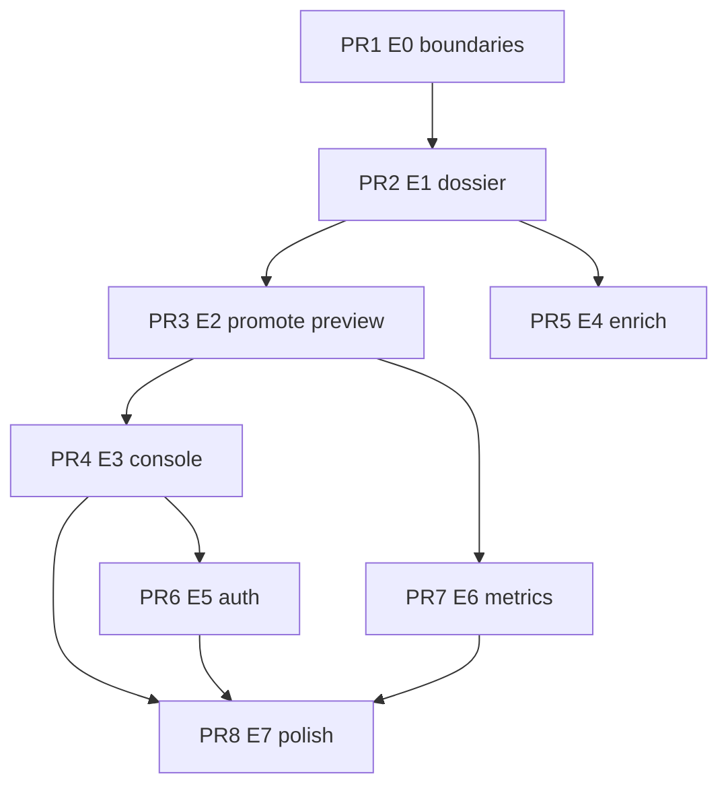

# Epic: Review Console (Phase E)

**Goal:** World-class **ingest → review → promote** UX with honest data
boundaries.

**Builds on:** Phase A–D ([EPIC_DEAL_UNIVERSE.md](./EPIC_DEAL_UNIVERSE.md)),
deal spine ([SPRINT_DEAL_SPINE.md](./SPRINT_DEAL_SPINE.md)).

**North star:** Reviewer opens a **staging dossier**, edits promotion fields,
previews verified JSON diff, promotes — no CLI, no inferred sector/HQ, no
conflating candidates with verified deals.

**Milestone:** `Review Console (Phase E)` on GitHub.

---

## Data boundaries (incorporated, not deferred as features)

See [DATA_BOUNDARIES.md](./DATA_BOUNDARIES.md). Summary:

| Deferred                      | Allowed pattern                                          |
| ----------------------------- | -------------------------------------------------------- |
| Unbounded web crawl           | Bounded SEC + manual CSV only                            |
| Auto-promote on LLM alone     | LLM triage; human attests promote                        |
| NIH/PubMed as deal discovery  | Enrichment on company/deal pages only                    |
| Crunchbase universe expansion | Grade D discovery or `crunchbaseUrl` link field          |
| Form D → verified M&A         | `lacuna_funding_events` panel only; cross-link read-only |

---

## GitHub issues

| Issue                                                | Title                                                            | Phase | Est.  |
| ---------------------------------------------------- | ---------------------------------------------------------------- | ----- | ----- |
| [#95](https://github.com/maekass/Lacuna/issues/95)   | `[Phase E0] Stop invented promotion fields + DATA_BOUNDARIES`    | E0    | 2–3d  |
| [#96](https://github.com/maekass/Lacuna/issues/96)   | `[Phase E1] Staging deal dossier API + /deals/staging/[dealId]`  | E1    | 5–7d  |
| [#97](https://github.com/maekass/Lacuna/issues/97)   | `[Phase E2] Form-driven promotion + JSON preview diff`           | E2    | 5–7d  |
| [#98](https://github.com/maekass/Lacuna/issues/98)   | `[Phase E3] Unified Review Console at /deals#review`             | E3    | 4–5d  |
| [#99](https://github.com/maekass/Lacuna/issues/99)   | `[Phase E4] Pre-review enrichment (8-K fetch, duplicate detect)` | E4    | 7–10d |
| [#100](https://github.com/maekass/Lacuna/issues/100) | `[Phase E5] Production reviewer auth + audit log`                | E5    | 3–4d  |
| [#101](https://github.com/maekass/Lacuna/issues/101) | `[Phase E6] Metrics, changelog honesty, post-promote loop`       | E6    | 4–5d  |
| [#102](https://github.com/maekass/Lacuna/issues/102) | `[Phase E7] Polish, demo scripts, epic doc refresh`              | E7    | 2–3d  |

Issue bodies live in `docs/issues/e0-boundaries.md` … `e7-polish.md`.

---

## Pathway stack (E4+ — one branch, one PR)

After **#103 (E0)** and **#105 (E1+E2)** merged, remaining phases use a **single
stacked branch** instead of per-phase PRs:

| Item           | Value                                                                                    |
| -------------- | ---------------------------------------------------------------------------------------- |
| **Branch**     | `feat/review-console-e1-e2-staging`                                                      |
| **Open PR**    | One PR at a time → `main` (currently [#108](https://github.com/maekass/Lacuna/pull/108)) |
| **Automation** | `npm run review-console:stack`                                                           |

```bash
# Before starting a phase (sync with main)
npm run review-console:stack -- prepare

# … implement E5 / E6 / E7 on feat/review-console-e1-e2-staging …

# Commit, then ship (push + refresh PR)
npm run review-console:stack -- ship --phase E5

# After the pathway PR merges to main
npm run review-console:stack -- after-merge
npm run review-console:stack -- ship --phase E6
```

Push to the pathway branch **updates the open PR automatically** — no new PR per
phase.

---

## Step-by-step PR plan (historical E0–E3)

E0–E3 shipped as separate PRs
([#103](https://github.com/maekass/Lacuna/pull/103),
[#105](https://github.com/maekass/Lacuna/pull/105),
[#106](https://github.com/maekass/Lacuna/pull/106)). E4+ uses the pathway stack
above. Original per-phase branch names:

`feat/review-console-e{N}-{short-name}`.

### PR 1 — Phase E0: Promotion honesty + data boundaries

**Branch:** `feat/review-console-e0-boundaries`

**Closes:** [#95](https://github.com/maekass/Lacuna/issues/95)

**Changes:**

1. `buildPromotionDraft.ts` — remove default `inferSector()` / `hq: "Unknown"`;
   return `missingFields[]` instead of inventing values.
2. `promotionChecklist.ts` — fail promote when required reviewer fields absent.
3. `docs/DATA_BOUNDARIES.md` — three-tier model + five deferrals.
4. Link from `AGENTS.md`, `NEW_DEAL_WORKFLOW.md`, `EPIC_DEAL_UNIVERSE.md`.
5. Tests: `__tests__/lib/ingestion/buildPromotionDraft.test.ts`.

**Verify:**

```bash
npm run lint && npm test && npm run validate:dataset
```

**PR title:**
`feat: block invented promotion fields and document data boundaries`

---

### PR 2 — Phase E1: Staging deal dossier

**Branch:** `feat/review-console-e1-staging-dossier`

**Depends on:** PR 1 merged

**Closes:** [#96](https://github.com/maekass/Lacuna/issues/96)

**Changes:**

1. `GET /api/deals/pending/[dealId]` — single `PendingDealRecord` + metadata.
2. `src/app/deals/staging/[dealId]/page.tsx` — candidate banner, not verified.
3. Reuse `EvidenceLadder` + parse-quality / blocker panel.
4. `DealReviewQueue` — “Open dossier” link per card.
5. Optional: `staging/[dealId]/opengraph-image.tsx` with CANDIDATE watermark.

**Verify:**

```bash
npm test -- __tests__/api/deals/pending
npm run build
```

**PR title:** `feat: staging deal dossier at /deals/staging/[dealId]`

---

### PR 3 — Phase E2: Promotion form + preview

**Branch:** `feat/review-console-e2-promote-preview`

**Depends on:** PR 2 merged

**Closes:** [#97](https://github.com/maekass/Lacuna/issues/97)

**Changes:**

1. `PromotionForm` on staging dossier — sector, HQ, sources[], parties, dates,
   value.
2. `GET /api/deals/pending/[dealId]/promote/preview` — draft + diff + validation
   errors.
3. `POST .../promote` — accept optional `draft` body (zod validated).
4. `PromotionPreviewDiff` component — show companies/acquirers/acquisitions
   diff.
5. Promote CTA only from dossier (queue → dossier → promote).
6. Tests for preview + promote API.

**Verify:**

```bash
npm test -- __tests__/lib/ingestion/promotion
npm run validate:dataset
```

**PR title:** `feat: form-driven promotion with verified JSON preview`

---

### PR 4 — Phase E3: Unified Review Console

**Branch:** `feat/review-console-e3-console`

**Depends on:** PR 3 merged (promote flow stable)

**Closes:** [#98](https://github.com/maekass/Lacuna/issues/98)

**Status:** ✅ shipped to `main` in commit `2d56a49` (2026-07-07).

**Changes:**

1. `/deals#review` tabbed layout: M&A queue | Funding | Import | Pipeline.
2. Move `DealReviewQueue`, `FundingEventsPanel`, `CandidateImportPanel`,
   `DataIngestPanel`.
3. `PipelineStatusStrip` as console header; SLA chip (oldest pending age).
4. `GET /api/deals/pending?source=efts|sec|manual` filter param.
5. Hub CTAs → `/deals#review`.

**PR title:** `feat: unified review console with M&A, funding, import tabs`

---

### PR 5 — Phase E4: Pre-review enrichment

**Branch:** `feat/review-console-e4-enrich`

**Depends on:** PR 2 merged (dossier exists); can ship after PR 4

**Closes:** [#99](https://github.com/maekass/Lacuna/issues/99)

**Status:** 🚧 on pathway branch →
[#108](https://github.com/maekass/Lacuna/pull/108)

**Changes:**

1. `src/lib/ingestion/enrichPendingDeal.ts` — fetch 8-K when `keyword_only`.
2. `POST /api/deals/pending/[dealId]/enrich` — bounded, rate-limited.
3. Duplicate detection vs verified JSON + pending queue.
4. “Enrich” button on staging dossier; before/after UI.
5. `sec:ingest-efts --enrich` optional flag; never auto-approve.

**PR title:**
`feat: bounded 8-K enrichment and duplicate detection for candidates`

---

### PR 6 — Phase E5: Production reviewer auth

**Branch:** `feat/review-console-e5-auth`

**Depends on:** PR 4 merged

**Closes:** [#100](https://github.com/maekass/Lacuna/issues/100)

**Changes:**

1. Choose auth: GitHub OAuth allowlist | Clerk `reviewer` role | Vercel
   password.
2. Replace raw API-key cookie as primary production path.
3. `review_audit_log` table + migration.
4. Log approve / reject / promote with actor + timestamp.
5. `docs/REVIEW_CONSOLE.md` env matrix.

**PR title:** `feat: production reviewer auth and promote audit log`

---

### PR 7 — Phase E6: Metrics + post-promote loop

**Branch:** `feat/review-console-e6-metrics`

**Depends on:** PR 3 merged

**Closes:** [#101](https://github.com/maekass/Lacuna/issues/101)

**Changes:**

1. `getDatasetChangelog()` — separate verified vs candidate counts.
2. Hub / Methods footnote: “N verified · M candidates” with definitions.
3. Queue metrics API: approve/reject/pending, median age.
4. Post-promote success → link `/deals/[acquisitionId]`.
5. Optional: GitHub Action PR promotion with dataset diff.

**PR title:** `feat: honest growth metrics and post-promote verified deal link`

---

### PR 8 — Phase E7: Polish + docs

**Branch:** `feat/review-console-e7-polish`

**Depends on:** PRs 4–7 (as available)

**Closes:** [#102](https://github.com/maekass/Lacuna/issues/102)

**Changes:**

1. `docs/DEMO_SCRIPTS.md` — 2 min reviewer walkthrough.
2. Mobile pass: staging dossier + review console.
3. E2E: unlock → dossier → preview promote (mock DB).
4. Refresh `EPIC_DEAL_UNIVERSE.md` (Review UI ✅, Phase E table).

**PR title:** `chore: review console demo scripts and epic doc refresh`

---

## PR dependency graph



**Critical path:** PR1 → PR2 → PR3.\
**Parallel after PR3:** PR4, PR7. **Parallel after PR2:** PR5.

---

## PR checklist (pathway stack, E4+)

1. `npm run review-console:stack -- prepare`
2. Implement scope for one phase on `feat/review-console-e1-e2-staging`
3. `npm run lint && npm test && npm run validate:dataset && npm run build`
4. `npm run review-console:stack -- ship --phase EX`
5. Merge pathway PR to `main`, then
   `npm run review-console:stack -- after-merge`

---

## Definition of done (whole epic)

- [ ] Staging dossier URL for every pending `dealId`
- [ ] Promotion requires explicit reviewer fields; preview shows JSON diff
- [ ] Single Review Console at `/deals#review`
- [ ] Enrich improves keyword-only rows without auto-merge
- [ ] Production auth without shared secrets in UI
- [ ] Hub shows verified vs candidate counts honestly
- [ ] Post-promote links to verified deal spine
- [ ] `DATA_BOUNDARIES.md` linked from agent rules
- [ ] CI green; `validate:dataset` on every promotion path
